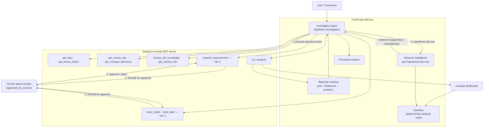

# FaultTrace — Autonomous Forensic Agent for Physical Systems

**Hackathon:** TrueForge Agent Harness Hackathon (Aug 24–30, 2026)
**MVP substrate:** Vehicle diagnostics (OBD-II / DTC forensics)
**Harness:** [TrueForge](https://github.com/truefoundry/trueforge)

> "Something expensive broke. Figure out why and prove it. Ask a human before you touch anything."

## What FaultTrace is

FaultTrace is an **autonomous forensic investigation agent**, not a chatbot and not an "AI mechanic."
Given a failure event (a diagnostic trouble code plus surrounding sensor conditions), it performs a
full investigation: it gathers heterogeneous evidence, forms **competing explanations**, predicts what
each should look like in the data, tests those predictions with **real computed code in a sandbox**,
ranks causes with **deterministic Bayesian math**, identifies the evidence it still cannot distinguish,
recommends the next diagnostic step, and **stops for a human before any physical-world action**.

The vehicle diagnostic domain is the **implemented MVP** in which this investigation engine is
demonstrated. The engine architecture itself generalizes to other safety-sensitive physical systems.

### The problem: a DTC tells you what a vehicle noticed, not why

A code like `P0171` ("system too lean") can be explained by a chatbot in one answer. But forensic
diagnosis is an **investigation process**: the same code can come from a vacuum leak, a contaminated
MAF sensor, a weak fuel pump, or an O2 sensor that is *lying* about a real condition. Telling them
apart requires retrieving independent evidence, forming hypotheses, testing each against the
telemetry, and resolving the ambiguity — iteratively, with the ability to pause and resume.

### Why this needs an agent, not a chatbot

A chatbot generates an answer. FaultTrace must **perform an investigation**. The harness (TrueForge)
is doing real work — not sitting underneath a thin wrapper:

| Investigation requirement | TrueForge capability | FaultTrace usage |
| --- | --- | --- |
| Reach the vehicle's systems | MCP | DTCs, freeze frames, telemetry, history |
| Parallelize specialized inquiry | Dynamic subagents | Per-hypothesis investigation fan-out |
| Run real computed analysis | Sandbox | Signal processing & Bayesian statistics |
| Long-running investigation | Persistent sessions | Hypotheses & evidence preserved across steps |
| Multi-step execution | Agent loop | Tool → result → reasoning → next action |
| Physical-world boundary | Human approval | Gate every Tier-2 / Tier-3 vehicle action |

> FaultTrace is not a chatbot with TrueForge attached. The investigation workflow depends on TrueForge
> to orchestrate tools, execute sandbox analysis, delegate investigation work, maintain session state,
> and enforce human approval boundaries.

## The investigation loop

```
Failure event (DTC + freeze-frame + sensor conditions)
      ↓
Observe — read-only evidence via MCP tools
      ↓
Form competing root-cause hypotheses, each with a PREDICTED SIGNATURE
      ↓
Generate analysis for each hypothesis
      ↓
Execute analysis in the sandbox (real compute, not LLM text math)
      ↓
Evaluate supporting vs contradictory evidence
      ↓
Bayesian update: prior × likelihood → posterior differential
      ↓
Identify remaining uncertainty (what the evidence cannot yet distinguish)
      ↓
Choose the next diagnostic (highest expected information gain, lowest cost)
      ↓
STOP for human approval before any physical action (Tier 2 / Tier 3)
      ↓
New evidence arrives → investigate continues
      ↓
Defensible root-cause conclusion, with uncertainty stated
```

The agent continues autonomously whenever the next step can be determined from available evidence and
read-only tools. It involves a human **only** when information is genuinely unavailable, a physical
diagnostic action is required, or an irreversible action is being considered.

## Real Bayesian analysis (deterministic, not vibes)

The engine's confidence is computed, not narrated. `sandbox/analysis/analyze.py` is a pure-stdlib,
deterministic library (FFT, cross-correlation, sensor plausibility, anomaly detection) that implements
a real Bayesian update:

```
posterior(hypothesis) ∝ prior(hypothesis) × likelihood(telemetry | hypothesis)
```

- **Priors** come from DTC knowledge (`lookup_dtc_knowledge`), which is scenario-specific.
- **Likelihoods** are computed from the actual telemetry via deterministic discriminators
  (fuel-trim/load correlation, MAF plausibility & jitter, O2 switching, misfire timing).
- **Active diagnosis** uses real `expected_information_gain` (base-2 entropy reduction, in bits) to
  pick the next test: lowest-cost within 90% of the best gain.
- Everything is seeded and reproducible — the posteriors in the demo are exactly the numbers the
  analyzer produces.

So the headline claims are numbers the code literally outputs. Each hypothesis also carries its
predicted signature and explicit supporting/contradictory evidence and "why not" reasoning — but the
ranking itself is computed.

## Hero scenario (Scenario A — vacuum leak)

The demo hero is **Scenario A**: a lean misfire under load (`P0171` + `P0300`) on a 2003 Honda Accord
EX 2.4L. Unmetered air enters through a cracked brake-booster vacuum hose; the ECU compensates with
rising fuel trims until misfires appear. The analysis (`cross_correlate(trim, load)` + MAF
plausibility) correctly ranks **vacuum leak** above *bad MAF* and *ignition* — clear, legible, and
great on camera.

| Scenario | Vehicle | Fault | DTCs |
| --- | --- | --- | --- |
| **A (hero)** | 2003 Honda Accord EX 2.4L | Vacuum leak (cracked brake-booster hose) | P0171, P0300 |
| B | 2005 Toyota Camry LE 2.4L | MAF sensor contamination (hot-wire coated) | P0171, P0102, P0300 |
| C | 2004 Ford F-150 XLT 5.4L V8 | O2 sensor stuck lean (no switching) | P0171, P0133 |

Scenarios B and C remain for breadth/regression coverage.

## Evidence vs inference vs hypothesis

FaultTrace keeps these distinct so the reasoning is auditable:
- **Observed** — facts retrieved from tools (e.g. `STFT = +23%`, `MAF = 8.1 g/s`).
- **Derived** — deterministic interpretation (e.g. "fuel system is compensating for a lean condition").
- **Hypothesis** — a candidate causal explanation (e.g. "unmetered air entering downstream of the MAF").
- **Test** — what should be measured/analyzed next, chosen by expected information gain.
- **Conclusion** — an evidence-backed result with supporting, contradictory, and unresolved factors stated.

## MCP tools (real inventory)

**13 MCP tools** exposed by the mock vehicle server across Tier-1 (read/analyze), Tier-2 (diagnostic),
and Tier-3 (irreversible). Every tool listed below exists in `mcp-server/src/tools.js`:

| Tier | Tools | Gating |
| --- | --- | --- |
| 1 (read) | `list_vehicles`, `get_dtcs`, `get_freeze_frame`, `get_pid_list`, `get_sensor_log`, `get_compact_telemetry`, `get_service_history`, `lookup_dtc_knowledge`, `get_vehicle_info` | Autonomous |
| 1 (analyze) | `run_analysis` — computes the sandbox Bayesian differential, per-test expected information gain, and the recommended next test | Autonomous |
| 2 (diagnostic) | `request_measurement` | Pauses for human approval |
| 3 (irreversible) | `clear_codes`, `order_part` | Pauses for human approval |

## Active diagnosis and persistent investigations

- **Active diagnosis.** FaultTrace recognizes when it cannot yet distinguish hypotheses and says what
  it needs to know: `run_analysis.recommended_test` selects the next measurement that best separates
  the leading competing hypotheses while minimizing cost/risk.
- **Persistent investigations.** A FaultTrace investigation is a persistent TrueForge session, not a
  single model call. It gathers evidence, forms hypotheses, pauses for approval, accepts new
  diagnostic evidence, and **resumes the same investigation** preserving prior evidence and reasoning
  (the demo session survives reconnects / restarts).

## Safety model

- **Tier 1 — Read/analyze:** autonomous.
- **Tier 2 — Diagnostic actions** (e.g. `request_measurement`): pauses for human approval.
- **Tier 3 — Irreversible actions** (`clear_codes`, `order_part`): pauses for approval, never autonomous.

Gated tools require `approved_by_human=true`; the harness displays and pauses before execution, and the
MCP server independently refuses unapproved calls as defense-in-depth.

*Investigate freely. Act carefully.*

## Demo

[▶ Watch the 3-minute FaultTrace demo](VIDEO_URL)

The video demonstrates: DTC event → MCP evidence retrieval → subagent investigation → competing
hypotheses → sandbox analysis → evidence-based hypothesis evaluation → missing-evidence identification
→ human approval gate → new evidence → investigation continuation → final forensic conclusion. TrueForge
is visibly central throughout.

*Screenshots of the running investigation UI (timeline, evidence/hypotheses, and approval gate) are
added here.*

## Architecture

See [docs/SPEC.md](docs/SPEC.md) for the full specification.



**The three eligibility proofs, in order:** a *real MCP tool call* (evidence retrieval + `run_analysis`),
generated *code running in the sandbox* (deterministic signal analysis), and a *pause for a human*
before any Tier-2 / Tier-3 physical action.

## Quickstart

```bash
# 1. Requirements: Node.js >= 22.13
node -v

# 2. Install (applies the Windows kysely migration patch automatically)
npm install

# 3. Start the harness
npm start          # runs @truefoundry/trueforge on http://localhost:8790

# 4. Configure a model provider in the UI (Settings -> Models):
#    OpenRouter (z-ai/glm-5.3-flash) is the primary provider — $5 top-up recommended

# 5. Start the mock vehicle MCP server (HTTP transport)
cd mcp-server && npm install && npm run start:http
#    serves http://localhost:9090/mcp — register it as a remote MCP server
#    named "faulttrace-vehicle" in TrueForge Settings -> Connectors

# 6. Create the agent from agent/faulttrace-investigator.agent.json
#    (model: openrouter/z-ai-glm-5.3-flash; sandbox enabled — set a Daytona key first)

# 7. (Optional) Run the investigation dashboard UI
cd fault-trace-ui && npm install && npm run dev   # http://localhost:3000
```

### Windows note

TrueForge v0.1.4 fails to start on Windows because kysely's `FileMigrationProvider` passes raw
`C:\...` paths to ESM `import()`. `patches/kysely+0.29.5.patch` fixes this and is applied
automatically via `postinstall` (patch-package). See PR #2 for details.

### Model notes

| Provider | Status | Notes |
| --- | --- | --- |
| OpenRouter (`z-ai/glm-5.3-flash`) | Primary | $5 top-up; `stealth/ox-alpha` was retired (404) and replaced |
| Google AI Studio Flash | Backup | Free tier quota-limited |
| Mistral | Backup | Free tier = 4 req/min |
| Groq | Unusable | 8K tokens/min cap < prompt size |

### Sandbox requirement

The agent definition enables the sandbox (`config.sandbox.enabled: true`) because hypothesis testing
must run as real computed code, not LLM text math. TrueForge's catalog uses the **Daytona** provider —
set a Daytona API key in Settings → Sandbox before creating sessions from this definition.

### Tests

```bash
cd mcp-server
npm test            # smoke.mjs + stdio.mjs — 13 tools, 3 scenarios, ground-truth filtering
node tests/http.mjs # HTTP transport suite (server must be running)
```

The smoke test validates: tool registration, 3-VIN support, freeze-frame values, sensor windows,
compact telemetry, DTC knowledge with correct priors, `get_vehicle_info` ground-truth filtering,
Tier-2/3 gating, and DTC state mutations.

### Eval harness

```bash
node eval/run_eval.mjs   # asserts each scenario's top posterior matches its ground-truth cause
```

Scenario A → `vacuum_leak`, Scenario B → `maf_fault`, Scenario C → `o2_sensor_fault` (3/3 PASS).

## Project Status

### Implemented
- [x] TrueForge agent (`faulttrace-investigator`) with MCP tools + dynamic subagents + sandbox
- [x] Mock vehicle MCP server (13 tools, 3 deterministic seeded scenarios)
- [x] DTC / freeze-frame / sensor / service-history / knowledge retrieval
- [x] Sandbox analysis library (FFT, correlation, plausibility, anomaly)
- [x] Real Bayesian posterior + expected-information-gain active diagnosis
- [x] Human approval gates (Tier-2 measurement, Tier-3 clear-codes / order-part)
- [x] Persistent / resumable investigations (TrueForge sessions)
- [x] Responsive investigation dashboard UI (`fault-trace-ui`)
- [x] Eval harness (regression checks vs ground truth)

### Simulated / Mocked
- [x] Vehicle telemetry (synthetic, seeded)
- [x] Physical diagnostic actions & parts ordering (mocked, no real money/hardware)

### Not Implemented
- [ ] Real OBD-II hardware / real vehicle control
- [ ] Real parts procurement
- [ ] Production fleet operation

## Qodo Code Review Evidence

Every substantive change merged through a pull request reviewed by Qodo before merge — direct pushes to
`main` were never used for reviewed work. Representative merged PR with meaningful hackathon code:
**[PR #10 — expose `run_analysis` tool that invokes the sandbox Bayesian analysis](https://github.com/Harshul-Dwivedi/FaultTrace/pull/10)**.

**What Qodo surfaced and what we changed (or intentionally dismissed):**

- On **PR #10** Qodo flagged that `run_analysis` could override the posterior that the orchestrator had
  already derived from subagent evidence, creating two competing sources of truth. We fixed this by
  keeping `run_analysis` the **single authoritative** source of the posterior and making subagents
  *evidence-only* contributors, then pushed a follow-up review against the final code.
- On **PR #11** Qodo flagged that the `get_vehicle_info` tool description still advertised a scenario
  description after the response was intentionally allow-listed to `vin`/`scenario_id`/`vehicle` (the
  description holds ground-truth and must stay hidden). We aligned the MCP schema contract with the
  allow-listed response and replied in-thread with the fix reference.
- We intentionally **dismissed with reason, in-thread**, the finding that the smoke test should be
  converted to CommonJS: this repo's committed test files are all ESM (`smoke.mjs`, `stdio.mjs`,
  `http.mjs`) with `"type": "module"` in package.json, so keeping ESM is consistent with the actual
  test convention (the AGENTS.md CommonJS note is contradicted by the committed tests). That dismissal
  is recorded on PR #10 (and was likewise carried from PR #9).

**PR history (completed review → our decision → follow-up review):** PRs #4, #9, #10, #11 all show
merged reviews with our replies; PR #10 and #11 specifically record the finding-fix cycle above. The
full review thread, our decisions or dismissals, and the follow-up reviews against the final code are
visible in each pull request on GitHub.

## AI Development Disclosure

AI coding assistants were used during development for code generation, debugging, documentation, and
implementation assistance. All generated code was reviewed, tested, and understood by the project
author, and every substantive change went through a Qodo-reviewed pull request before merge.

## What's mocked / future work

- Synthetic vehicle data only — no real OBD-II hardware.
- Parts ordering is mocked; no real money moves.
- Three deterministic scenarios with seeded telemetry generators.

## Future vision

Vehicle diagnostics is the implemented MVP. The broader **physical-system investigation engine**
architecture could eventually be applied to industrial machinery, energy infrastructure, robotics,
manufacturing systems, and fleet equipment — but those use cases are future applicability, not
completed functionality.

## License

MIT
